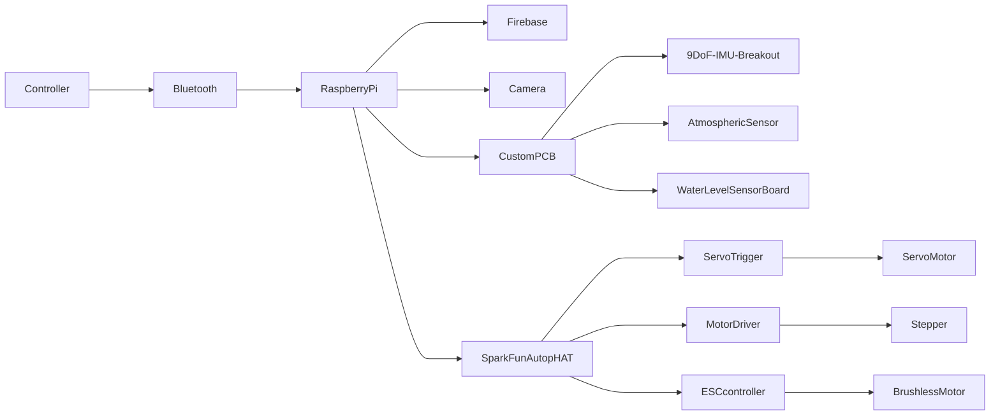

# CSCI4050 - Project ASL Translation: {title to be decided}

## Proposal/Project Specifications   
[Link to proposal](wk01proposal.md).

## Table of Contents 
[Table of Contents](#table-of-contents)   
[List of Figures](#list-of-figures)   

1. [Design proposal](#10-designproposal)
2. [Libraries required](#20-librariesrequired)
3. [Dataset(s)](#30-dataset(s))
4. [Integration](#40-integration)
   1. [Phase one](#41-phase-one)
   2. [Phase two](#42-phase-two)
   3. [Phase three](#43-phase-three)
5. [Firmware code](#50-firmwarecode)
6. [Acronyms](#60-acronyms)
7. [References](#70-references)

## List of Figures   
[Figure 1: Gantt Chart 2023](#figure-1-gantt-chart-2023)     

### 1.0 Design proposal
This project involves the development of a machine learning model capable of recognizing hand gestures connected to American Sign Language (ASL).
The scope is to recognize letters and/or digits from images and possibly expand to simple phrases like "Hello" or "Goodbye".
The system will take an image of a hand performing a sign as input and output the corresponding alphabet, number or simple word.
The idea is to use static images at first and try to expand into live translation.
 

<b>Design Approach</b>

  
### 1.1 Project Requirements and Specifications   
1. a
2. b

### 2.0 Libraries required
Through our project we utilize different libraries
These include:   
<b>
A. Stuff
</b>

### 3.0 Dataset(s)
Dataset 1:
 

## 4.0 Integration 

### 4.1 Phase one
This phase of integration includes the following:  

### 4.2 Phase two
This phase two of integration includes the following:

### 4.3 Phase three
This is the last phase of development in which the finals parts of the code and project were finalized, here we:

### 5.0 Firmware code   

### 5.1 main.py
stuff  

## 6.0 Acronyms
stuff  

## 7.0 References   
https://realpython.com/python-sockets/  
