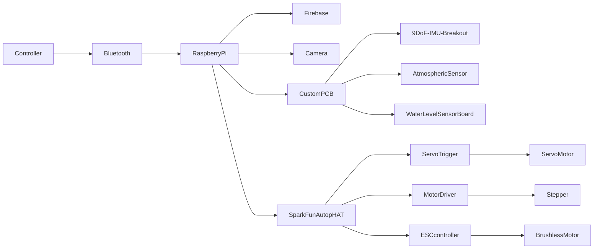

# CSCI4050 - Project {name to be decided}
Title Page (1st odd page not numbered, X.0 sections begin on odd pages, otherwise double sided and numbered)

## Proposal/Project Specifications   
[Link to proposal](wk01proposal.md).

## Table of Contents 
[Table of Contents](#table-of-contents)   
[List of Figures](#list-of-figures)   
   
1. [Integration](#30-integration)
   1. [Phase one](#301-phase-one)
   2. [Phase two](#302-phase-two)
   3. [Phase three](#303-phase-three)
8. [Acronyms](#50-acronyms)
9. [References](#60-references)

## List of Figures   
[Figure 1: Gantt Chart 2023](#figure-1-gantt-chart-2023)     

### 1 Design proposal
*stuff*
 
 

<b>Design Approach</b>

  
### 1.1 Project Requirements and Specifications   
 
1. a
 
2. b

### 2 Libraries required
Through our project we utilize different libraries
These include:   
<b>
A. Stuff
</b>

## 3.0 Integration 

### 3.0.1 Phase one
This phase of integration includes the following:  

### 3.0.2 Phase two
This phase two of integration includes the following:

### 3.0.3 Phase three
This is the last phase of development in which the finals parts of the code and project were finalized, here we:

### 4.1 Firmware code   
This section contains the completed code for our hardware.
 

## 5.0 Acronyms
stuff  

## 6.0 References   
https://realpython.com/python-sockets/  
