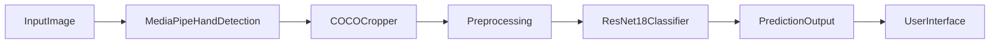

# CSCI4050 - Visisign: ASL Translation project

## Proposal/Project Specifications
[Link to proposal](https://github.com/Megadast/CSCI4050-machine-learning/blob/main/Documents/Project%20Proposal.pdf)

## Project Submission and details page
[Link to proposal](https://docs.google.com/document/d/1fHhpxRTeGKunU2NyJhxFJ5Jxy0uY3lJdPAncQGu8nMs/edit?tab=t.0)

## Table of Contents
[Table of Contents](#table-of-contents)   
[List of Figures](#list-of-figures)

- [1.0 Design Proposal](#10-design-proposal)
  - [1.1 Project Requirements and Specifications](#11-project-requirements-and-specifications)
- [2.0 Libraries Required](#20-libraries-required)
- [3.0 Dataset(s)](#30-datasets)
- [4.0 Integration](#40-integration)
  - [4.1 Phase One](#41-phase-one)
  - [4.2 Phase Two](#42-phase-two)
  - [4.3 Phase Three](#43-phase-three)
- [5.0 Acronyms](#50-acronyms)
- [6.0 How to Run](#60-how-to-run)
- [7.0 References](#70-references)

## List of Figures   
[Figure 1 Final Output](#figure-1-final-output)

[Figure 2 Real Annotated](#figure-2-real-annotated)

### 1.0 Design proposal
This project involves the development of a machine learning model capable of recognizing hand gestures connected to American Sign Language (ASL).
The scope is to recognize letters and/or digits from images and possibly expand to simple phrases like "Hello" or "Goodbye".
The system will take an image of a hand performing a sign as input and output the corresponding alphabet, number or simple word.
The idea is to use static images at first and try to expand into live translation.
<br>

<b>Design Approach (For now)</b>


  
### 1.1 Project Requirements and Specifications   
- Implement automated dataset downloading using Roboflow API
- Preprocess images using PyTorch transforms
- Train a CNN classifier capable of recognizing ASL (American Sign Language)
- Build a prediction pipeline that supports folder-based batch testing
- Implement simple automatic hand detection using Mediapipe
- Real-time recognition

## 2.0 Libraries Required <br>

### 2.1 PyTorch <br>
Model training and inference

### 2.2 torchvision <br>
Transformations, datasets

### 2.3 numpy <br>
Numerical operations

### 2.4 Pillow (PIL) <br>
Image IO

### 2.5 Mediapipe <br>
Simple hand detection 

### 2.6 python-dotenv <br>
Roboflow API credential loading

### 2.7 Roboflow <br>
Dataset downloading

### 3.0 Dataset
https://universe.roboflow.com/sign-recognintion/sign-recoginition/dataset/1 <br>
Offers datasets for letters, numbers and common phrases 

### 3.1 Model Class List (47 total) <br>
Digits (10) <br>
0–9 <br>
Alphabet (26) <br>
A–Z <br>
Phrases (11) <br>
ExcuseMe, Food, Hello, Help, House, I Love You, Internet, No, Please, ThankYou, Yes <br>
Total model output classes -> 47

## 4.0 Integration 

### 4.1 Phase One — Dataset + Baseline Model
- Implemented automatic Roboflow dataset download / extraction
- Loaded dataset using PyTorch's ImageFolder
- Filtered classes based on labels found in dataset
- Built a Convolutional Neural Network based on the ResNet18 architecture
- Trained with adjustable epoch controls and live progress output
- Saved best model as models/asl_best.pth

### 4.2 Phase Two — Prediction Pipeline
- Added predict.py to evaluate any image or folder of images
- Added hand cropping as preprocess_coco.py to:
  - Read COCO annotations
  - Crop bounding boxes
  - Organize images by class
- Implemented sorted testing using /test/ directory
- Reports per-image predictions and test accuracy
- Enables quick evaluation with real-world photos

### 4.3 Phase Three - Project Submission
- Code restructuring
- Bug fixes + stability improvements
- Performance optimization
- Presentation slides & documentation
- Final project demonstration

## 5.0 Acronyms
ASL — American Sign Language <br>
ML — Machine Learning <br>
CNN — Convolutional Neural Network <br>
HSV — Hue Saturation Value (color space used in skin detection) <br>

## 6.0 How to Run

### Prerequisites
- Python 3.8 or higher
- pip package manager

### Installation and Execution

1. Install required dependencies:
```bash
pip install -r requirements.txt
```

2. Set up environment variables (create a `.env` file in the project root):
```
ROBOFLOW_API_KEY=your_api_key_here
ROBOFLOW_WORKSPACE=your_workspace
ROBOFLOW_PROJECT=your_project_name
ROBOFLOW_VERSION=1
```
(You'll need an API key from Roboflow to access the dataset for our program, instructions on how to do so can be found here: https://docs.roboflow.com/developer/authentication/find-your-roboflow-api-key)

3. Run the complete pipeline:
```bash
python main.py
```

This will:
- Download the ASL dataset from Roboflow (if not already downloaded)
- Preprocess images using MediaPipe hand detection
- Train the model on MediaPipe-aligned crops
- Save the best model to `models/asl_best.pth`
- Test the model using the images found in `/data_downloaded/test`
- Create visualized output for how the images are processed with Mediapipe in `/real/output`

### Output Sample
**Final Output**


**Annoted output**


## 7.0 References
Roboflow ASL Dataset:
https://universe.roboflow.com/sign-recognintion/sign-recoginition/dataset/1 <br>
PyTorch Documentation:
https://pytorch.org <br>
MediaPipe Documentation:
https://ai.google.dev/edge/mediapipe/solutions/guide <br>
