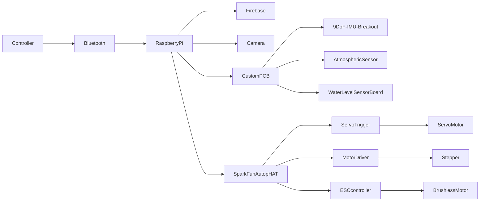

# CSCI4050 - Visisign: ASL Translation project

## Proposal/Project Specifications
[Link to proposal](https://github.com/Megadast/CSCI4050-machine-learning/blob/main/Documents/Project%20Proposal.pdf)

## Table of Contents
[Table of Contents](#table-of-contents)   
[List of Figures](#list-of-figures)

- [1.0 Design Proposal](#10-design-proposal)
  - [1.1 Project Requirements and Specifications](#11-project-requirements-and-specifications)
- [2.0 Libraries Required](#20-libraries-required)
- [3.0 Dataset(s)](#30-datasets)
- [4.0 Integration](#40-integration)
  - [4.1 Phase One](#41-phase-one)
  - [4.2 Phase Two](#42-phase-two)
  - [4.3 Phase Three](#43-phase-three)
- [5.0 Firmware Code](#50-firmware-code)
  - [5.1 main.py](#51-mainpy)
- [6.0 Acronyms](#60-acronyms)
- [7.0 References](#70-references)

## List of Figures   
[Figure 1: Gantt Chart 2023](#figure-1-gantt-chart-2023)     

### 1.0 Design proposal
This project involves the development of a machine learning model capable of recognizing hand gestures connected to American Sign Language (ASL).
The scope is to recognize letters and/or digits from images and possibly expand to simple phrases like "Hello" or "Goodbye".
The system will take an image of a hand performing a sign as input and output the corresponding alphabet, number or simple word.
The idea is to use static images at first and try to expand into live translation.
 

<b>Design Approach</b>

  
### 1.1 Project Requirements and Specifications   
1. a
2. b

### 2.0 Libraries required
Through our project we utilize different libraries
These include:   
<b>
A. Stuff
</b>

### 3.0 Dataset(s)
Possible Dataset 1: https://www.kaggle.com/datasets/prathumarikeri/american-sign-language-09az  
This one is good and offers from A-Z and 0-9 in Sign Language. Perfect for ML training with picture  
Posssible Dataset 2:https://universe.roboflow.com/sign-recognintion/sign-recoginition/dataset/1  
This one is also very good and offers an even wider range of Sign Language, but it might be difficult to work with, and work better with pure AI instead.  
 

## 4.0 Integration 

### 4.1 Phase one
This phase of integration includes the following:  

### 4.2 Phase two
This phase two of integration includes the following:

### 4.3 Phase three
This is the last phase of development in which the finals parts of the code and project were finalized, here we:

### 5.0 Firmware code   

### 5.1 main.py
stuff  

## 6.0 Acronyms
ML -> Machine Learning
ASL -> American Sign Language

## 7.0 References   
https://realpython.com/python-sockets/  
