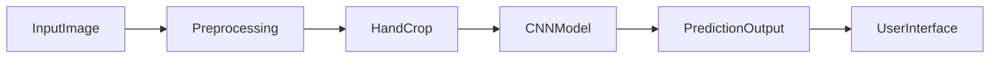

# CSCI4050 - Visisign: ASL Translation project

## Proposal/Project Specifications
[Link to proposal](https://github.com/Megadast/CSCI4050-machine-learning/blob/main/Documents/Project%20Proposal.pdf)

## Project Submission and details page
[Link to proposal](https://docs.google.com/document/d/1fHhpxRTeGKunU2NyJhxFJ5Jxy0uY3lJdPAncQGu8nMs/edit?tab=t.0)

## Table of Contents
[Table of Contents](#table-of-contents)   
[List of Figures](#list-of-figures)

- [1.0 Design Proposal](#10-design-proposal)
  - [1.1 Project Requirements and Specifications](#11-project-requirements-and-specifications)
- [2.0 Libraries Required](#20-libraries-required)
- [3.0 Dataset(s)](#30-datasets)
- [4.0 Integration](#40-integration)
  - [4.1 Phase One](#41-phase-one)
  - [4.2 Phase Two](#42-phase-two)
  - [4.3 Phase Three](#43-phase-three)
- [5.0 Firmware Code](#50-firmware-code)
  - [5.1 main.py](#51-mainpy)
- [6.0 Acronyms](#60-acronyms)
- [7.0 References](#70-references)

## List of Figures   
[Figure 1: Gantt Chart 2023](#figure-1-gantt-chart-2023)     

### 1.0 Design proposal
This project involves the development of a machine learning model capable of recognizing hand gestures connected to American Sign Language (ASL).
The scope is to recognize letters and/or digits from images and possibly expand to simple phrases like "Hello" or "Goodbye".
The system will take an image of a hand performing a sign as input and output the corresponding alphabet, number or simple word.
The idea is to use static images at first and try to expand into live translation.
 

<b>Design Approach (For now)</b>

  
### 1.1 Project Requirements and Specifications   
- Implement automated dataset downloading using Roboflow API
- Preprocess images using PyTorch transforms
- Train a CNN classifier capable of recognizing ASL (American Sign Language)
- Build a prediction pipeline that supports folder-based batch testing
- Implement simple automatic hand detection using Mediapipe
- Real-time recognition

2.0 Libraries Required  

2.1 PyTorch  
model training and inference

2.2 torchvision  
transformations, datasets

2.3 numpy  
numerical operations

2.4 Pillow (PIL)  
image IO

2.5 OpenCV  
simple hand detection & cropping

2.6 python-dotenv  
Roboflow API credential loading

2.7 Roboflow  
dataset downloading

### 3.0 Dataset
https://universe.roboflow.com/sign-recognintion/sign-recoginition/dataset/1  
Offers datasets for letters, numbers and common phrases 

## 4.0 Integration 

### 4.1 Phase One — Dataset + Baseline Model
- Implemented automatic Roboflow dataset download / extraction
- Loaded dataset using PyTorch's ImageFolder
- Filtered classes based on labels found in dataset
- Built a Convolutional Neural Network based on the ResNet18 architecture
- Trained with adjustable epoch controls and live progress output

### 4.2 Phase Two — Prediction Pipeline
- Added predict.py to evaluate any image or folder of images
- Implemented sorted testing using /test/ directory
- Added basic hand cropping
  - Use of HSV for skin detection
- Reports per-image predictions and test accuracy
- Enables quick evaluation with real-world photos

### 4.3 Phase Three - Project Submission
- Double-checking
- Fixing bugs
- Create a presentation

## 6.0 Acronyms
ASL — American Sign Language  
ML — Machine Learning  
CNN — Convolutional Neural Network  
HSV — Hue Saturation Value (color space used in skin detection)  

## References
Roboflow ASL Dataset:
https://universe.roboflow.com/sign-recognintion/sign-recoginition/dataset/1  
PyTorch Documentation:
https://pytorch.org  
MediaPipe Documentation:
https://ai.google.dev/edge/mediapipe/solutions/guide  
